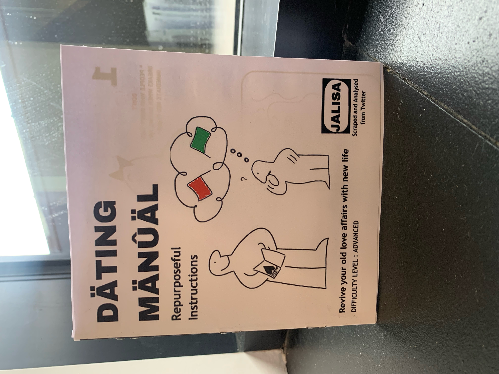
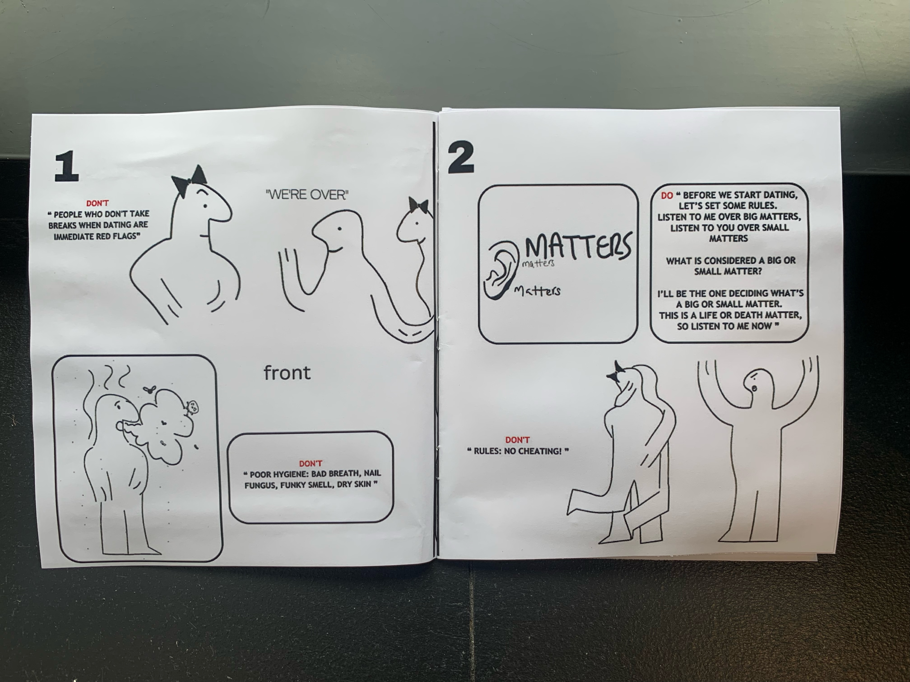
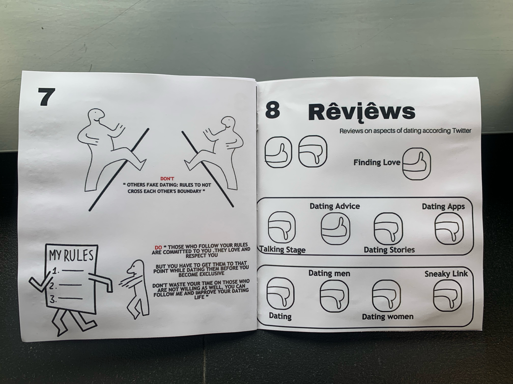
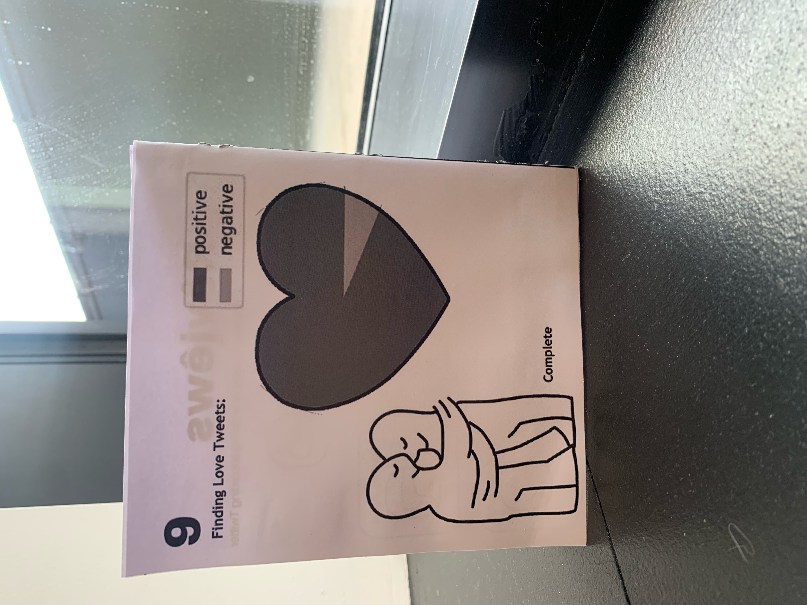
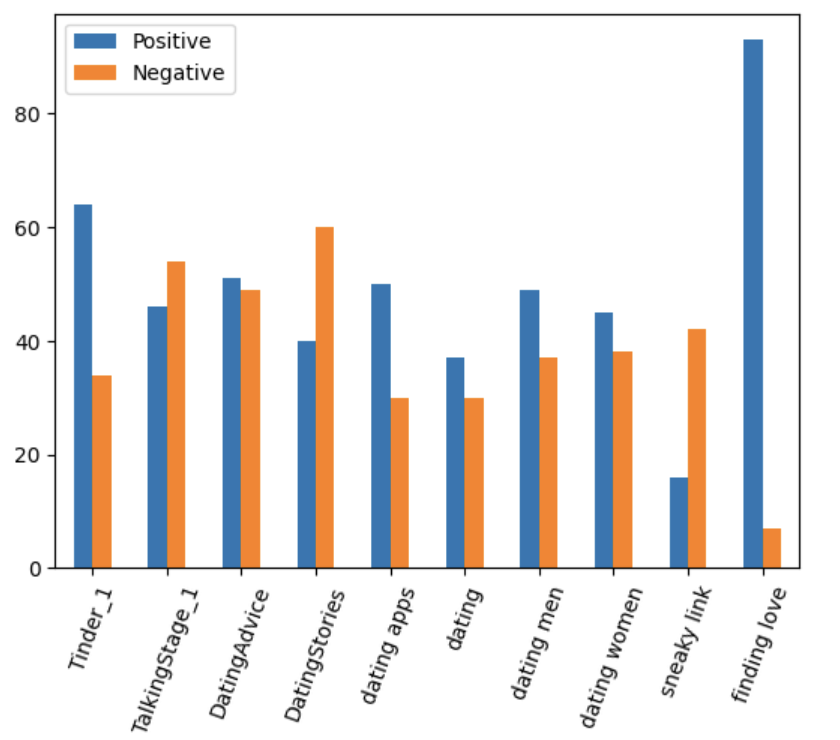
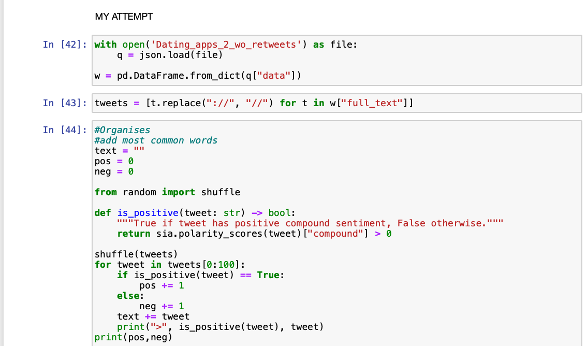
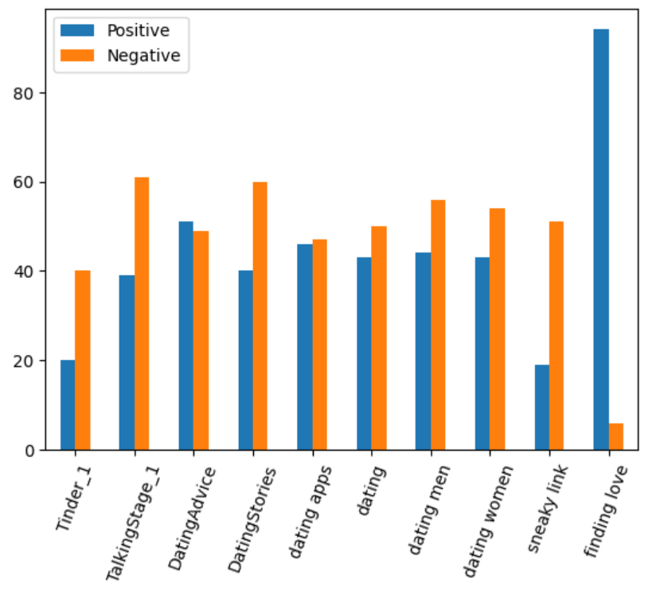
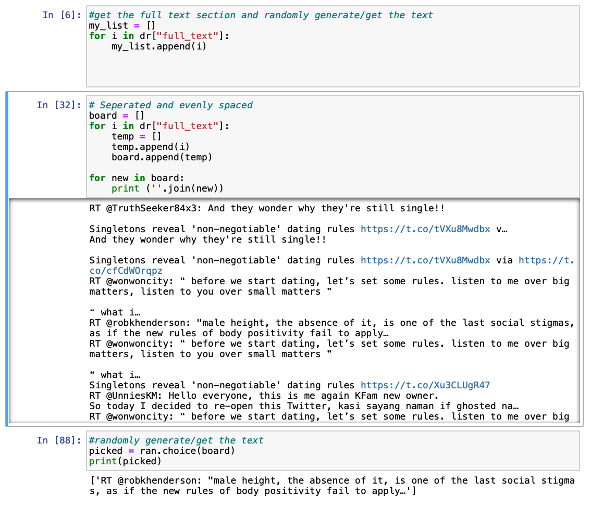

# Big Data : Dating Manual
By Jalisa Abeid

# Table of Contents
- ### Abstract
- ### Goal/Purpose
- ### The Concept Behind the Visualisation
- ### Code 
- ### Research
- ### Challenges
- ### Improvements 
- ### References

# Abstract 
Society has come to the consensus that modern-day dating is chaotic and tiresome. As a part of the digital age, there are constant stories of peoples’ experiences dating from successes to horrors. Within online forums, chat rooms, podcasts and social media, dating is a relatable and popular topic to discuss and within these digital spaces, people have very strong opinions on the topic. These clear guidelines of what is acceptable in dating culture led to the development of this project. The project follows the dating do’s and don’ts according to people. As there are many differing opinions on dating, I decided to scrape and analyse tweets from Twitter to gain insight into people’s rules and requirements of a partner and themselves. I chose Twitter as many people share their opinions on the site, I could scrape a lot of data on dating under multiple hashtags, different feeds and accounts. Also, Twitter is a very open platform so everyone can communicate their honest opinions with each other. 

<pre></pre>

# Goal / Purpose
Traditionally, a romantic relationship starts with two people going on dates and developing emotional and then physical closeness. However, social developments and social media have changed the narrative. There are so many elements to dating from talking stages to friends with benefits. All these aspects are confusing and different people seem to define them in different ways and, accordingly, have different expectations(Šutić, 2022). Having dating rules seems like a chore and dampens the fun of dating however studies show that within unregulated spaces users become required to develop their own rules and codes of conduct(Byron et al, 2018). Although dating rules and requirements allow people to narrow their options to people that fit their preferences, it provides safety and comfort within an overwhelming space. The goal of the project is to reflect certain dating requirements of the public. From people’s red and green flags in a partner to people’s rules they adopt. To highlight all these rules are personal and we all require different traits and qualities from a partner, so having many dating rules can be restrictive. As well as understanding the opinions of dating, I wanted to understand what aspects of dating the majority of people enjoy and dislike for example first dates.

<pre></pre>

# The Concept Behind the Visualisation

<em>Figure 1: Front Page of Dating Manual </em>

<pre></pre>

The data represented in the display was collected from Twitter using Twitter’s API. Specifically, retrieving tweets under tags associated with dating like dating apps and talking stages. In terms of visualisation, I chose to curate a physical dating manual. The design of the booklet is inspired by IKEA instruction manuals from the layout to the signature IKEA character. I curated a manual because the concept of dating dos and don'ts aligns well with a step-by-step instruction guide. As there are many rules, I decided to present randomly generated tweets from the files scraped as a rulebook. The manual consists of 9 pages. Each page consists of at least 2 or more tweets with text above indicating if the tweet is a do or don’t rule of dating. Also, the tweets are allocated with illustrations I drew relating to the content/subject of the tweet, as shown in Figure 2.

<em>Figure 2: Page from dating manual project consisting of randomly generated tweets with assigned drawing </em>

<pre></pre>

A key point, I wanted to ensure was that the manual consisted of a variety of opinions, ensuring there is not a bias in views. To show tweets with rules about traits people are attracted to traits people avoid, tweets that don’t necessarily align with my own views as well as light-hearted rules and more serious rules. It was important to display a range of opinions to highlight the scope of how different everyone’s dating rules are.

<em>Figure 3: Review section of Dating Manual </em>

<pre></pre>

The left side of Figure 3, shows the reviews section of the booklet. The reviews are based on people’s feelings towards the selected aspects of dating, whether people like or dislike the chosen topic. The good reviews are indicated with a thumbs up whereas the bad reviews are indicated with thumbs down. The rating system was deciphered using semantic analysis, to count how many positive and negative tweets there are within each file. The review results were based on a majority rule system dependent if there were more positive tweets than negative and vice versa. 3 out of 10 topics had more positive tweets than negative ones. (Side note: The 3rd topic was not included in the review section as it would not fit with the layout/positioning of the page, the third topic was Tinder). The topics that have more negative tweets have a common theme and vice versa positive excluding Tinder. The badly reviewed topics highlight peoples’ experiences, and the past whereas dating advice and finding love highlight hopefulness in people and the future. This polarity depicts that despite peoples’ bad experiences with dating, people are optimistic and in pursuit of eventually having love. This analysis led to the exploration into the finding of love tweets on the final page.

<em>Figure 4: Final Page. Pie Chart of Finding love tweets </em>

<pre></pre>

Figure 4 is an extension of the reviews page showing the results of the ratio between positive and negative tweets. The number of positive tweets surpasses the number of negative tweets. The last page is a reflection of the analysis previously mentioned about people being confident in finding love. The heart-shaped pie chart was curated using panda and then editing/cutting out the shape to make the heart outline. 

<pre></pre>

# Code

To access and scrape the tweets, I used Tweepy to connect Twitter API. With each scraping of tweets, I had a maximum of 100 tweets. Having that factor/constraint in mind, it was important to ensure (1) scrape tweets as regularly as possible to fit the brief of big data and ensure there is a variety of opinions, (2) get tweets about dating under different tags to also have variety and (3) remove retweets so there is no repetition. To ensure I fit the brief of big data, I scraped and saved 21 files of tweets that date back to almost two months ago. To guarantee I had a large scope of tweets with varying opinions, I began writing a list of words that relate to dating i.e. dating dos/don’ts, cheating, red and green flags in a relationship, dating scenarios, etc. I would query these keywords when scraping the tweets. As well as search specific threads related to dating from accounts that focus on love and relationships like Oloni and The Receipts Podcast. All data was saved and stored as a JSON file. After collecting all of the data needed, it was necessary to understand the emotions towards dating through the tweets. Using sentiment analysis within NLTK and VADER allowed me to understand whether the tweets were negative or positive across all the files. Using NLTK, I removed all stop words, punctuation and emojis and tokenized the tweets, which is the process of splitting an entire sentence into separate words. The result is the tweet containing only keywords. With each file, I used a sentiment analyser to determine whether a tweet was positive, negative or neutral and count each amount. 

<em>Figure 5: Sentiment Analysis of Tinder file which was more positive according to VADER </em>

<pre></pre>

Each file’s sentiment analysis results were logged in a table. I decided to place the collected data into a bar chart  using panda to find pattern within the files.

<em>Figure 6: Code for bar chart</em>
<pre></pre>

The final outcome of all the files is shown in Figure 7.

<em>Figure 7: VADER analysis bar chart</em>

I compared both VADER and NLTK sentiment analysis to decide which one to use within my project. I compared the same files and produced the same bar chart. VADER and NLTK analysis results are the complete opposite with only 4 files with similar results. With VADER having more positive tweets and NLTK having more negative tweets. I decided to read the tweets in the ‘Dating Apps’ file as the results are polar between NLTK and VADER. When I read the tweets within the ‘Dating Apps’ file, I found there to be more negative tweets. The NLTK sentiment analysis supports this notion.

<em>Figure 8:  NLTK sentiment analysis</em>
<pre></pre>

<em>Figure 9: Bar chart result of NLTK Sentiment analysis</em>
<pre></pre>

Even though VADER is more catered to social media meaning it can understand more colloquial language, the analyser would pick up filler words for example “like” and interpret it as the verb like, causing certain tweets that were overall negative to be registered as positive. Although both sentiment analysers are not completely accurate, I decided to apply NLTK results to my final project.

The goal of the sentiment analysis was to show peoples’ feelings towards certain topics within dating as the information can highlight the majority of people’s favourite and least favourite parts of dating. This data was translated into my final project shown in Fig 3, inside the reviews section of the instruction manual. Most of the files, positive and negative tweets were within a similar range. The only file with a disproportionate ratio of positive and negative tweets was finding love. This could interpret by society that although their wavering opinions on dating, people are hopeful and like the concept of finding love. This data was reflected on the final page of the instruction manual, as shown in Fig 4.

In order to curate the pie chart, I calculated the mass of the positive and negative tweets within the finding love file. I divided the total of each amount by 100 and then multiplied by 360 to result in the mass. Then plotted the points to create the pie chart, as shown in Fig 10.

<em>Figure 10: Pie chart results and code</em>

Finally, in order to get the individual tweets shown in the instruction manual, I specifically scraped tweets under the tags “do’s and don’ts of dating”, “red flag”, ”green flag” and “dating rules”. I wanted to ensure when scraping that tweets were clear and direct so it would easy to illustrate the opinions found which is why the tweets had to follow the tags above. As well as constantly scrape tweets, in order to have a variety of opinions showcased in the final project. To decide which tweets to show, isolated the full text column of the DataFrame and looped through the column, taking the text and appending the information to a list. Resulting in a list of strings. Then I randomly generated the list, to decide what tweets to display in the instruction manual. Shown in Figure 11  below.

<em>Figure 11: Appending full text column to a list and randomly generating tweets</em>

<pre></pre>
# Research

In terms of research data, I followed multiple accounts on Twitter that focus on love and relationships for example Oloni and The Reciepts Podcast. In order to, scrape threads that could be potentially useful and find topics to incorporate into the project.

I was inspired by a project where the individual used the reviews for Tinder on the Google Play Store and applied sentiment analysis to curate a world cloud of the words people would use in the review section. This influenced the addition of the review section in the instruction manual.

<em>Figure 12: Negative reviews Sentiment analysis</em>

<em>Figure 13: Positive reviews Sentiment analysis</em>

Visually, I was inspired by IKEA instruction manuals. I mainly followed the format of a traditional IKEA manual by incorporating the same character style within adaptations to indicate a different character for example female characters have a bow in their hair as shown in Figure 14. As well as incorporating, the bold text that is typically associated with IKEA. The quirky and humorous illustrations are intended to visually engage readers and add visual context to accompany the tweet curating a story around the tweet. The comedic drawings took reference from the Illustrations “If Real Life Came with IKEA Instructions” curated by James Chapman, shown in Fig 15.

<em>Figure 14: Female character illustration </em>

<pre></pre>

<em>Figure 15: James Chapman illustration from  “If Real Life Came with IKEA instructions” </em>

Similarly to IKEA manuals, I kept the black and white theme with the black outline illustrations contrasting against the white space. As well as keep the layout clean and simple, with a maximum of 2 images per page. As instructions are direct and clear, I wanted to ensure the drawings were expressive whilst simple and compact so the images complement the tweets rather than distract from the information. 

# Challenges

At the beginning of formalising the project, I had difficulties with Twitter’s API for a few reasons:
-  The developer account I had with Twitter was v1 so I had limited access to Twitter API’s features. One factor I could only scrape 100 tweets at a time. Prior I had latency issues, I could only scrape 100 tweets every 15 minutes so originally the process of scraping was tedious.
- When I started my project, Twitter’s API had recently drastically changed because prior most features were free, so the possibility of more updates being added in turn restricting my access was a threat.
- Could only access tweets from a maximum of 9 days which limits the period of tweets I could retrieve for example I would not be able to access tweets about dating during covid

Another challenge was the sentiment analysis, as it is not completely accurate. When deciding if a tweet was positive or negative, the analyser would interpret tweets that are negative as positive and vice versa for example

<em>Figure 16: Negative reviews Sentiment analysis</em>

The inaccuracy of the sentiment analysis was a deciding factor for displaying the review section as thumbs up and down rather show numerical statistics.

# Improvements

To improve my project, I would analyse the tweets further by finding tweets that have similar opinions to provide more context on what people agree with or common outlooks towards dating rules. I conduct this research by removing stop words from the scraped tweets, then using sentiment analysis I would loop through the tweets and count the words that were most commonly used and append each tweet containing the common words in a separate list. This allows for more accuracy and understanding of the scope of how many people share the same dating rules.

Also to ensure there is more accuracy and precision with the sentiment analysis, I would use multiple sentiment analyses like TextBlob, NLTK and VADER and apply the positive or negative analysis on the files. Then each file will have 3 different results of sentiment analysis, to have more accuracy I would find the average of the three results combined. This removes the ambiguity of deciding which sentiment analysis is most correct.

Finally, I would fix the format of the pages because the pages are numbered incorrectly at the top.

# References

- Byron, P. and Albury, K., 2018. ‘There are literally no rules when it comes to these things’: Ethical practice and the use of dating/hook-up apps. *Digital intimate publics and social media*, pp.213-229.
- Šutić, L., Jelić, M. and Krnić, A., 2022. Is Dating Dead? Modern Dating Among Emerging Adults in Croatia. *Revija za sociologiju*, *52*(3), pp.359-386.

